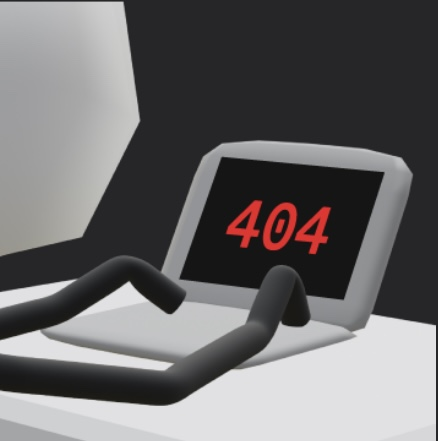

    
  

 
 

 
 
 
 
 
 
 
 
 
 
 
 
 
 
 
 
 
 
 
 
 
 
 
 
 
 
 
 
 
 
 
 
 
 
 
 
 
 
 
 
 
 
 
 
 
 
 
 
 
 
 
 
 
 
 

 
 
 
 
안녕하세요 김민승입니다
 
 
 
 
 
 

### 🐔 자유롭게 쓸수있어요 🐔

 

### 🐥 참고자료를 보면서 쓸수있어요 🐥

### 🐧 이러한 도구들을 주로 사용해요 🐧

### ✨ experience ✨
2024.03 - 2024.06 : 프로젝트X - 부트캠프
 
2024.07 - 2024.08 : 범일정보 인턴
 
2024.09 - now : 신한투자증권 프로디지털 아카데미 5기

### 📄 certificate 📄
정보처리기사
 
SQLD

### 🍀 TIL 🍀  
  

### 📫 Connect 📫
  

### 🔥 Stats 🔥

